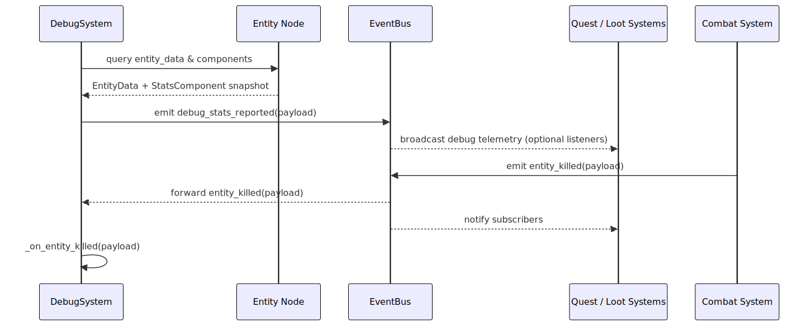

# Project Chimera Architecture Reference

This repository prototypes the compositional runtime architecture described in the Project Chimera design bible. The new diagrams
collected here summarize how core runtime objects interact so outside engineers can quickly orient themselves before touching
the Godot scenes or scripts.

## Entity Composition

Gameplay entities are ordinary Godot nodes added to the `entities` group. Each node exposes an `entity_data` property that points
to an `EntityData` resource responsible for storing identifying metadata plus a dictionary of component resources. All component
resources inherit from the `Component` base type, which enforces the data-only contract described in the style guide. Concrete
resources such as `StatsComponent` and `TraitComponent` extend this base class, bridging entity data to systems and higher-order
authoring tools. `TraitComponent` maintains references to modular `Trait` resources, while `Archetype` resources validate that a
generated entity exposes an allowed trait mix before entering play. See the diagram below for a visual summary of these
relationships.

## Event Flow Through the Global Event Bus

All gameplay systems extend the `System` base class, which centralizes helper methods for publishing and subscribing to the
autoloaded `EventBus` singleton. `DebugSystem` demonstrates the pattern by iterating over entity nodes, collecting their stats
component payload, and emitting a `debug_stats_reported` signal whenever new telemetry is captured for diagnostics. The `EventBus`
enforces payload contracts for shared signals such as `entity_killed`, allowing subscriber systems—quests, loot, analytics, and
debuggers—to respond without tight coupling. The sequence below captures both the stats reporting loop and the broadcast path
combat-oriented systems use when an entity is removed from play, matching the process documented in Section 1.3 of the Project
Chimera design doc.

## Diagram Sources

Editable Mermaid definitions are stored alongside the rendered assets in `devdocs/diagrams/` so future contributors can refresh
the images after architecture updates.
